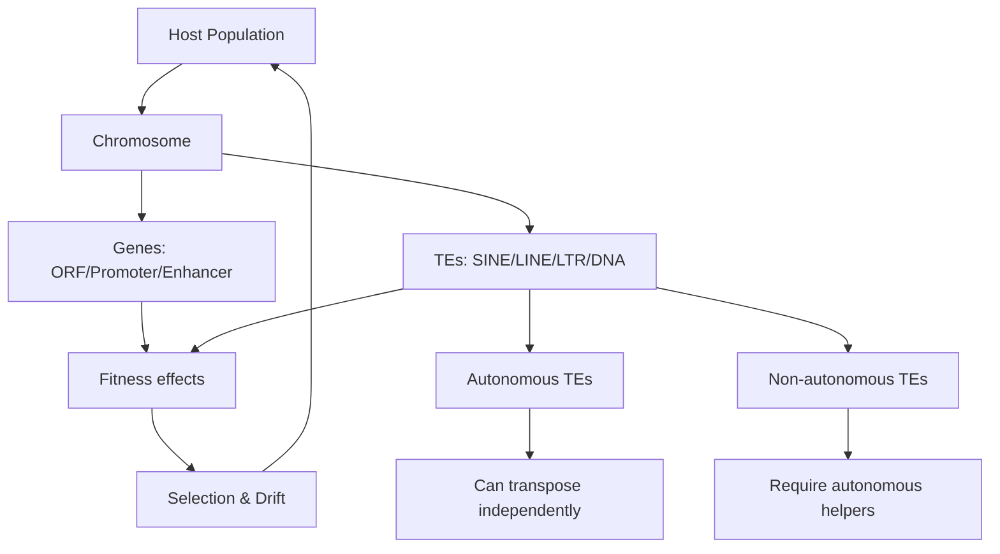

# TE-Agents2: High-Performance Transposable Element Simulation

**Agent-based model (ABM) of transposable elements (TEs) in the genomic ecosystem; optimized for array-based large-scale parallelized simulations with GPU acceleration.**

[](https://www.python.org/downloads/)
[](https://opensource.org/licenses/MIT)
[](https://cupy.dev/)
[](https://numba.pydata.org/)

## Why This Matters

• **TE Persistance & Niches**: Facilitates the investigation of TE persistence amidst a variety of selective pressures such as mutation, excision and silencing. Genomic positions and distance from other TEs and genes extends this idea to TE niches.

• **Agent-Based Advantages**: Captures individual TE-host interactions that population genetics and ODE models miss, enabling fine-grained analysis of genomic ecosystem dynamics and emergent behaviours.

• **Interdisciplinary Knowledge Dissemination**: ABMs are significantly more intuitive than pop-gen and ODE models, making this model an invaluable tool for biologists, computer scientists and philosophers in adjacent fields to apply their research to TEs and genome ecology.

## Quickstart (5-minute try)

```bash
# Clone and setup
git clone https://github.com/noahzeidenberg/TE-Agents2.git
cd TE-Agents2

# Create environment (choose conda, uv, etc.)
# e.g. with conda (NOT recommended for HPCs)
conda create -n te-sim python=3.10
conda activate te-sim
pip install -r requirements/requirements_final.txt

# OR with uv
uv venv
source .venv/bin/activate
uv pip install -r requirements/requirements_final.txt

# Run quick simulation
python ABM_files/TESim_ABM2.py

# Check results
ls -la *.csv  # Look for trace.csv with simulation data
```

## Model at a Glance



| Agent | States | Key Rules |
|-------|--------|-----------|
| **Host** | Fitness, Population size | Reproduction, Selection, Mutation |
| **Gene** | Subtype (ORF/Promoter/Enhancer), Position | TE insertion impact varies by subtype |
| **TE** | Type (SINE/LINE/LTR/DNA), Autonomous status | Jump probability, Death rate, Progeny distribution |
| **Chromosome** | Length, Element positions | Collision detection, Position adjustment |

## Performance & Determinism

**GPU Acceleration:**
```bash
# CUDA support (tested)
pip install cupy-cuda12x

# PyTorch alternative (untested)
pip install torch torchvision torchaudio
```
## Data

**Included:**
- `trace.csv`: Generation-by-generation statistics
- `state-*.gz`: Compressed simulation checkpoints
- `logs/simulation.log`: Detailed execution log

**Optional Generated Statistics:**
- TE counts by type (SINE/LINE/LTR/DNA)
- Gene counts by subtype (ORF/Promoter/Enhancer)
- Fitness distributions and percentiles
- Genome size evolution
- TE and gene location distributions
- Autonomous vs non-autonomous TE dynamics

## SLURM Workload Manager (e.g. on HPC) example

```bash
#!/bin/bash
#SBATCH --job-name=te-simulation
#SBATCH --nodes=1
#SBATCH --gpus-per-node=1
#SBATCH --cpus-per-task=16
#SBATCH --mem=64G
#SBATCH --time=1:00:00
#SBATCH --output=te_sim_%j.out
#SBATCH --error=te_sim_%j.err
#SBATCH --array=1-1 # easy to submit as an array job for parameter perturbation tests e.g. array=1-256%8 runs this script 256 times in groups of 8. Can easily read parameter ranges you want to test from a csv and pass into 'awk' or a config file in TMP dir

# Load modules
module load python/3.10
module load cuda

# Activate environment
source /path/to/te-sim/bin/activate

# Run simulation with custom parameters
python ABM_files/TESim_ABM2.py -c configuration_file.yaml
```

## Limitations & Known Issues

• **Stochastic variance**: Inherent variance in TE dynamics requires multiple replicates to estimate equilibria

• **Parameter uncertainty**: TE rates based on literature estimates; experimental validation recommended; limited research applicability for non-model organisms

• **Memory scaling**: Large genomes may require chunked processing

• **GPU memory**: CuPy requires sufficient VRAM for large simulations

## Cite / License / Acknowledgements

**Citation:**
```bibtex
@software{te_agents2,
  title={TE-Agents2: High-Performance Simulation of Transposable Elements in the Genomic Environment},
  author={Noah Zeidenberg},
  year={2024},
  url={https://github.com/noahzeidenberg/TE-Agents2}
}
```

**License:** MIT License

**Acknowledgements:**
- Based on the TE_World2 simulation by Dr. Stefan Kremer (University of Guelph)
- Thank you to Dr. Ryan Gregory, Dr. Stefan Kremer, Dr. Stefan Linquist, Dr. Karl Cottenie, Dr. Tyler Elliot, Dr. Brent Sailor and Mirza Ahmadi for their suggestions and guidance throughout this project
- Thank you to the Research Alliance of Canada for supporting this project

## FAQ / Troubleshooting

<details>
<summary><strong>Numba compilation errors</strong></summary>
```bash
# Try exact requirements
pip install -r requirements/requirements_exact.txt
</details>

<details>
<summary><strong>Memory issues with large simulations</strong></summary>
```python
# Reduce batch sizes in config
performance:
  batch_size: 25  # Default: 50
  element_pool_size: 1000  # Default: 2000
```
</details>

## Reproducibility

**Determinism:**
- All random operations use configurable seed
- Seed logged in output files
---
