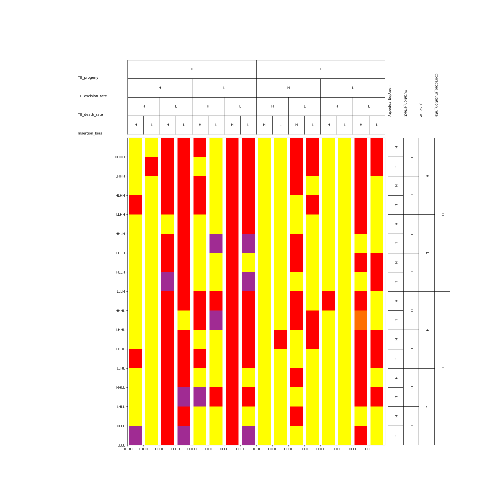

# TE-Simulations

This folder contains utility functions to generation a large amount of configuration files, run simulations and summarize the results of simulations.

This is the code to:
- Generate TE configuration files to runs simulations.
- Run the simulations.
- Graph the results of the simulations.

## Requirements

- pip2
- PyYAML

## Naming Conventions

Given the breadth of terms used to create these simulations, certain terms were standardized to establish a commond understanding:

- **Run:** A full simulation of a given experiment, including all the iterations needed to finish it.
- **Iteration:** A sequence of generations iterated through, making up a portion (and at most, the entire) experiment run/simulation.

## To Run

### Create Trace Graphs

[`CreateTraceGraphs.py`](CreateTraceGraphs.py) is a quick and easy-to-use program that takes CSV trace files that were produced by a list of trials, and outputs corresponding graphs that are predefined in the code. These include:

- Host Population vs Generation
- Total Live TEs vs Generation
- Live TE Percentiles vs Generation
- Total Dead TEs vs Generation
- Dead TE Percentiles vs Generation
- Fitness Percentiles vs Generation
- TE Deaths vs Generation
- TE Collisions vs Generation
- TE Jumps vs Generation
- TE Jump Effects vs Generation
- TE and Gene Locations
- Live autonomous/non-autonomous TEs vs Generation

#### Run `CreateTraceGraphs`

1. Navigate to the same folder as `CreateTraceGraphs.py` within your terminal.

2. Copy any trace files that you want to graph into this directory. They must be a CSV file, but they can be of any name.

3. Run `CreateTraceGraphs.py` with all of your input files passed as command line arguments.

```
python3 CreateTraceGraphs.py trace-001.csv test.csv
```

The graphs should be created and output as `.svg` files, for all of the specified trace files.

### Create Trials

```
python3 CreateTrials.py
```

The files will be subsequently created after running this command.

#### Command Line Arguments
- `-r <run>`: Creates `parameters.py` files in which the `saved` filed stores the most recent file name of a state file in the specified experimental run.

### Run Simulations

```
python3 ./RunSimulations.py
```

#### Command Line Arguments
- `-s`: skip validation message for script.
- `-f`: will run the script in 'fast mode'.
- `-r <run>` will run the script for the specified experimental run number.

#### Example: Re-running Simulations for a Specific Run

This example demonstrates the steps to re-run all unfinished simulations from simulation #1.


*Updates all parameters.py files, setting the `saved` field to point to the last state file for simulation #1.*

```
python3 CreateTrials.py -r 1
```

> **Note:** The above change will need to eventually be overriden when running the next run of experiments (i.e. run `CreateTrials.py` again without an specified run).

*Re-start simulations for run #1, skipping the validation message.*

```
python3 RunSimulations -s -r 1
```

### Analyze Results

```
python3 ResultsAnalyzer.py
```

The files (graphs, images, excel summaries) will be created and written to the `TE-Simulations/output` folder.

#### Command Line Arguments
- `-p`: enables partial results after a specified generation threshold (located in [`ResultsAnalyzer.py`](ResultsAnalyzer.py))

### Delete Simulation Results

```
./delete-simulation-files.sh
```

This deletes all CSV and state files associated with a simulation. **Do not run it** if you do not want to delete all your results. The actions in this script are irreversable.

## Analysis Notes

### TE Results Overview Plots

In the results overview plots the colours correspond with the following scenarios:

- **Teal:** TE persistence (both autonomous and non-autonomous)
- **Orange:** Autonomous TE persistence
- **Red:** Non-autonomous TE persistence
- **Yellow:** TE extinction (both autonomous and non-autonomous)
- **Purple:** Host extinction
- **White:** No results for experiment

